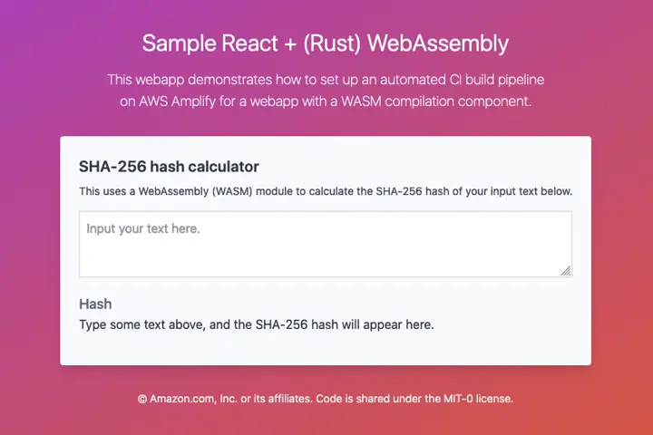
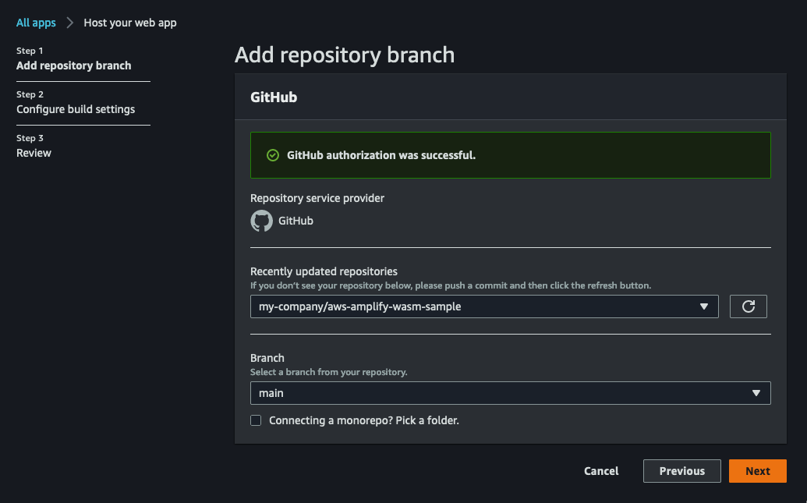
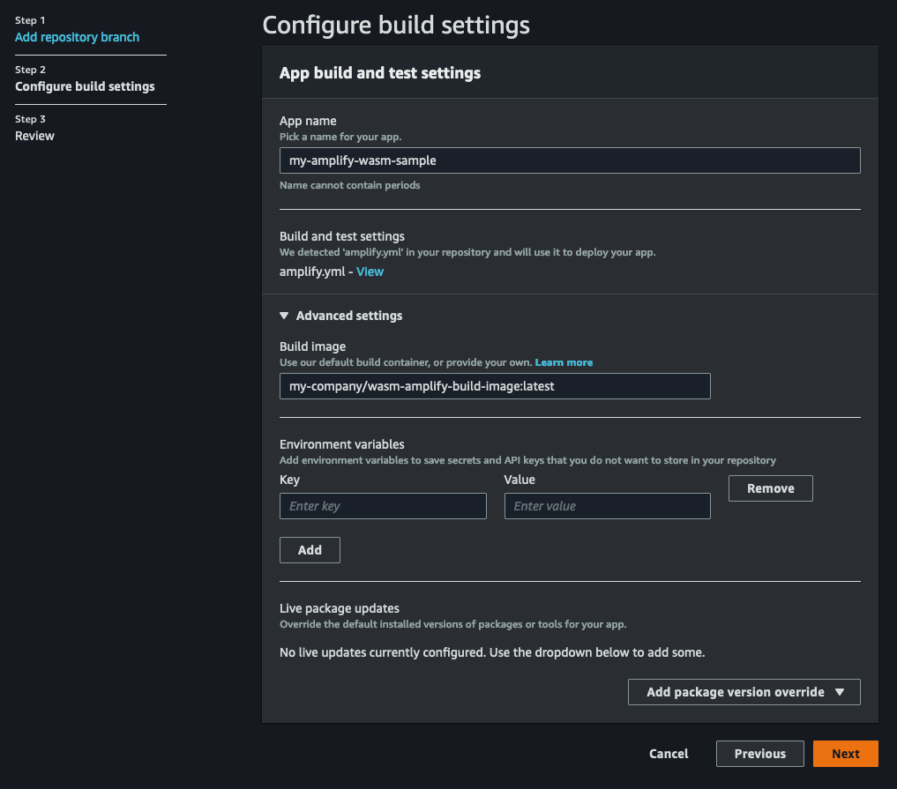
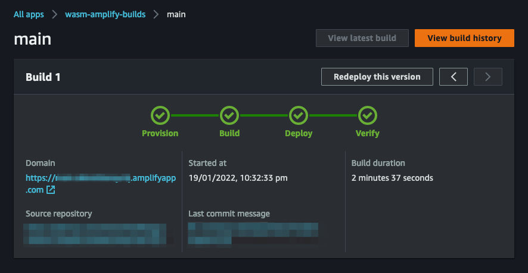

# AWS Amplify WebAssembly (WASM) Builds

This repository demonstrates a strategy for automating CI builds on AWS Amplify
for webapps that require a WebAssembly (WASM) module compiled as well.



### Why?

WebAssembly modules tend to be written in a different language than the webapp itself
(e.g. Rust, C/C++, C#, etc.) particularly because the WASM module needs to be _compiled_,
and is not just interpreted like how Javascript is. This complicates the build process,
as this means that the build environment will need both webapp _and_ WebAssembly
requirements available.

Here, we demonstrate how that can be done using custom build images.

While it is also possible to have the webapp and the WASM module codebases in separate
repositories (and separate CI build processes), this also forces us to deal with the
problem of synchronizing the builds together across potentially multiple platforms
(i.e. when build A finishes -> we should also then trigger build B).

This codebase uses a monorepo approach, because:

- there's a good chance that the WASM module is built specifically for a particular webapp,
  so it makes sense to keep them together, and

- having the WASM build artifact available to the webapp during its own build simplifies
  orchestration, and makes it easier to optimize the webapp further when bundling the
  WASM module together.

---

> **Note:**
>
> This repository uses the Rust language to create its WebAssembly modules,
> but you can easily adjust it to use your choice of language and frameworks.
>
> Here are some other alternatives you may want to take a look at:
>
> - [Emscripten][emscripten] (C/C++)
> - [Blazor][blazor] (C#)
> - [AssemblyScript][assemblyscript] (Typescript-like)

---

## Usage

This codebase has three distinct pieces:

- `/ci-build-image` is for building the custom build image used by the CI pipeline,
- `/wasm` is the codebase for the WebAssembly module, and
- `/webapp` is the codebase for the web application.

### :star: TL;DR :star:

All the steps below are bundled together in a [`Makefile`](Makefile), with the common
commands packaged together.

If you just want to get started as quickly as possible (and provided you have the
requirements below available on your environment), you can just run the following
and have it running on your local:

```bash
make build
```

### Requirements

You'll need the following tools to use this codebase:

- [`docker`][docker] for the custom build image,
- [Node.js][nodejs] (with [`yarn`][yarn]) for the webapp component, and
- [Rust][rust] and [`wasm-pack`][wasm-pack] for the WASM module.

> Note that `wasm-pack` currently requires that you use the `nightly` Rust channel.

Feel free to switch up the webapp and WASM technologies to other tech / frameworks / languages
that you are more familiar with — the approach demonstrated here is meant to be agnostic.

### Preparing the build image

The build image is defined by `ci-build-image/Dockerfile`.
You can create the image simply by:

```bash
# :: feel free to change the name / tag on the image
docker build -t wasm-amplify-build-image ./ci-build-image
```

Once you have the build image, you'll need to make it available to AWS Amplify ---
some common options would be [Docker Hub][docker-hub] or a public
[Amazon Elastic Container Registry (ECR)][ecr] repository.

More information on how to do this is in the [ci-build-image README][ci-build-image].

### Setting up a build pipeline on AWS Amplify

> To complete these steps, we assume that you already have a copy of this repository
> hosted in a git repository under your control. AWS Amplify currently supports
> [Github][github], [Gitlab][gitlab], [Bitbucket][bitbucket], and
> [AWS CodeCommit][codecommit].

On your [AWS Amplify Console][amplify-console], create a new app, opting to
**Host your web app**.

1. Specify where your codebase is hosted.
   You will need to provide the **repository name** and target **branch**.
   Any changes pushed to the specified branch will automatically trigger a build.

   > Do **NOT** tick the **connecting a monorepo** checkbox.
   > While this codebase uses a monorepo approach, the builds for the WASM and webapp
   > projects are not run in isolation, so there's no need to scope the build to just
   > a specific folder.

   > If this is your first time using AWS Amplify with your git platform, you will need
   > to complete authentication and authorization steps.

   

   Click **Next**.

2. In **Configure build settings**, provide an app name.
   AWS Amplify should also have automatically determined that your build steps are
   provided in the `amplify.yml` file in this repository.

3. Still in **Configure build settings**, expand the section on **Advanced settings**.
   Provide your custom build image in the space provided.

   > Your build image should have been uploaded somewhere it can be accessed by
   > AWS Amplify. More info on this is available on the [ci-build-image README][ci-build-image].

   

   Click **Next**.

4. Confirm your settings, and finalize app creation.

Your app should now be confirmed in AWS Amplify, and a build should have automatically
been triggered. This will use the latest version of assets in your repository.

If everything has been set up correctly, the build will be completed in a few minutes,
and your web app will be available through a URL provided by AWS Amplify.



---

## Building the webapp locally

If you'd like to try out the webapp + WASM setup locally in your dev environment,
you can absolutely do so as well. A `Makefile` is provided with this codebase that
summarizes the required commands, if you'd just like to get started as quickly as possible.

```bash
make serve
```

### Compiling the WASM module

To be able to compile the WASM module, you will need the following tools available:

- [Rust][rust] + `cargo` (installed with Rust by default)
- [wasm-pack][wasm-pack]

Compiling the WASM module is as simple as running the following from `/wasm`:

> The `-s wasm-amplify build` flag namespaces the resulting artifacts accordingly.
> You can freely change this to a namespace of your choice, but you need to make sure
> that this change is propagated correctly in the repository (namely in the webapp).

```bash
wasm-pack build --target web --release -s wasm-amplify-build
```

This creates the compiled artifacts in `/wasm/pkg` — the artifacts are arranged so that
the `/wasm/pkg` directory is a valid `npm` package bundle. Of note in the artifacts
are:

- a `package.json` file,
- the compiled wasm module `wasm_bg.wasm`, and
- the Javascript "glue" code `wasm.js`, prearranged for you.

Since we've specified `-s wasm-amplify-build` in the command above,
`package.json` will note that the package is called `@wasm-amplify-build/wasm`.

> This is the package name that is imported by the webapp in
> `/webapp/src/hooks/use-hasher.tsx`. If you used a different namespace, make sure
> the change is reflected in that file as well.

The `wasm-pack` crate does a great job of preparing the Javascript glue code for us
in `wasm.js`. To use the WASM module in our webapp, we simply need to import `wasm.js`,
which includes the initialization code, as well as any functions that are exposed
by the WASM module.

### Building the webapp

To build and serve the webapp at `/webapp`, it will need to be able to resolve where
the WASM module is (by default, it expects the package `@wasm-amplify-build/wasm` to be
available.)

This is most easily done by linking the `/wasm/pkg` package and `/webapp` projects together:

```bash
# From the project root

cd wasm/pkg
yarn link  # :: makes @wasm-amplify-build/wasm locally available

cd ../../webapp
yarn link @wasm-amplify-build/wasm  # :: explicitly links local @wasm-amplify-build/wasm to the webapp project
```

Once `@wasm-amplify-build/wasm` is available to `/webapp`, you can build it by running
the following from `/webapp`:

> This makes production build artifacts available at `/webapp/dist`.

```bash
yarn build
```

Production build artifacts are available at `/webapp/dist`.
This folder can then be uploaded to a hosting solution of your choice, using a
static or SPA webapp configuration.

You can also run a development web server hosting the webapp by:

```bash
yarn dev
```

By default, this makes your webapp available at `localhost:3000`.

---

## Security

See [CONTRIBUTING](./CONTRIBUTING.md) for more information.

## License

This project is licensed under the MIT-0 license.

[ci-build-image]: ./ci-build-image
[docker]: https://docker.com
[docker-hub]: https://hub.docker.com
[ecr]: https://aws.amazon.com/ecr
[amplify-console]: https://console.aws.amazon.com/amplify/home
[github]: https://github.com
[gitlab]: https://gitlab.com
[bitbucket]: https://bitbucket.com
[codecommit]: https://aws.amazon.com/codecommit
[rust]: https://rust-lang.org
[wasm-pack]: https://rustwasm.github.io/wasm-pack/
[nodejs]: https://nodejs.org
[yarn]: https://www.npmjs.com/package/yarn
[emscripten]: https://emscripten.org
[blazor]: https://dotnet.microsoft.com/en-us/apps/aspnet/web-apps/blazor
[assemblyscript]: https://www.assemblyscript.org
